# IUBAT_CPC_for_programming_club

To proper guidelines to our beginner programmers of the IUBAT Competitive programming club, we make an Online judge make for IUBAT_CPC here users can read problem statements and solve and submit their code and get Accepted and Wrong   Tech: Nodejs, MySQL, bootstrap, Ace code editor, GNU compiler

<h3>How set up your local environment</h3>
<li>Install NodeJs</li>
<li>Install MySQL</li>
<li>Import iubatcpc.sql file into your database </li>
<li>Run project</li>
 
<h2>Project Overview</h2>

<h3>Homepage</h3>
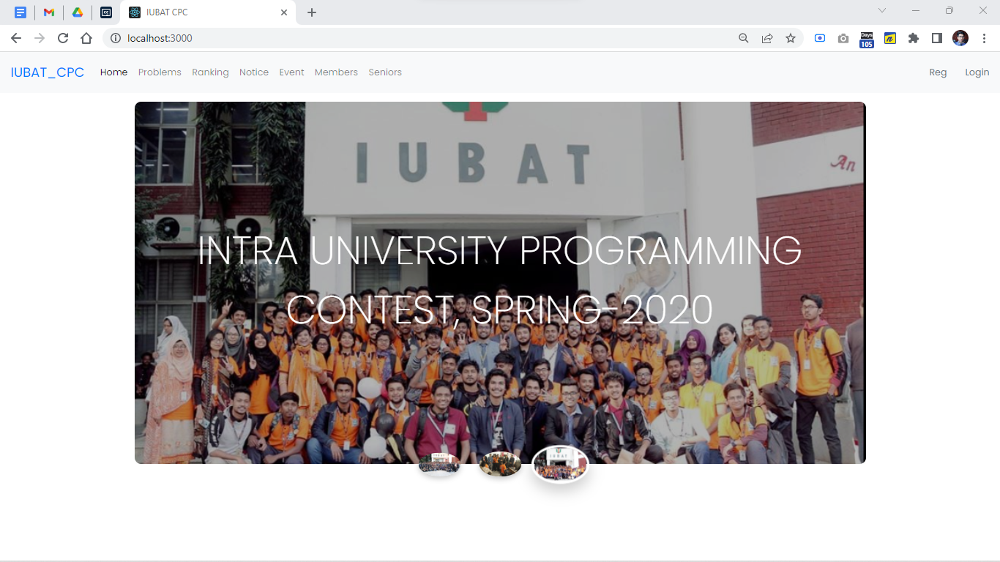

<h3>Registration</h3>
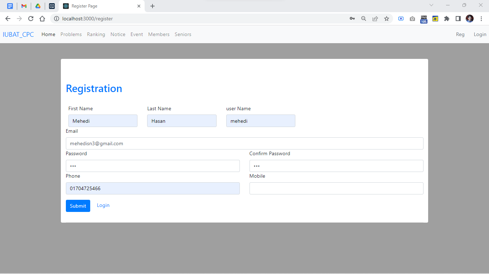

<h3>Login</h3>
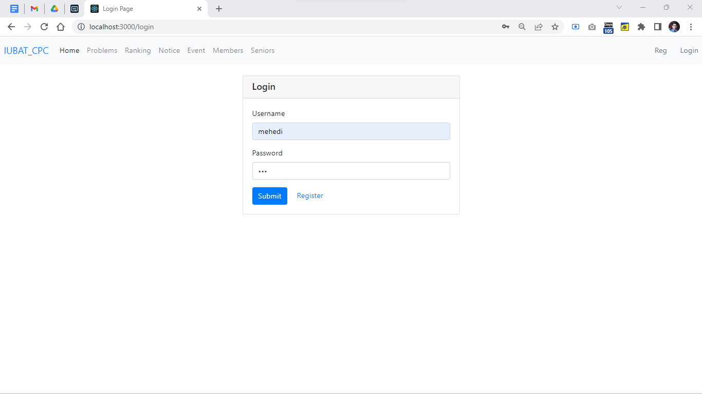

<h3>User Profile</h3>
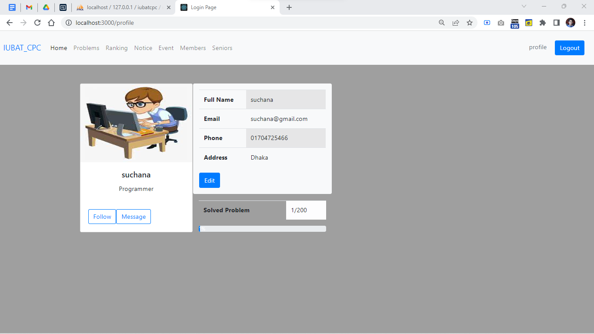

<h3>Problem List</h3>
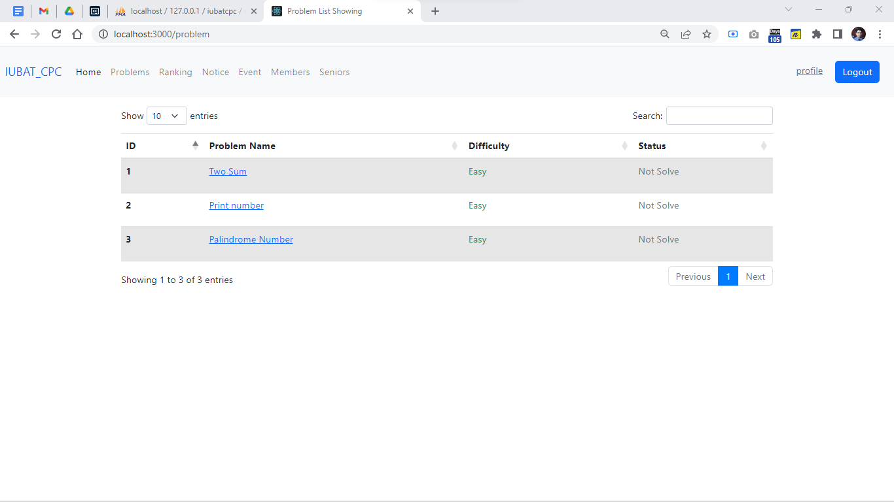

<h3>Problem Statement</h3>
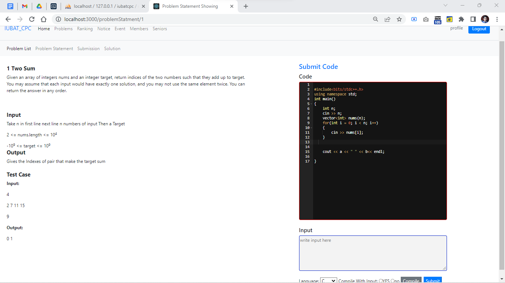

<h3>Write Compile Code with or without input</h3>
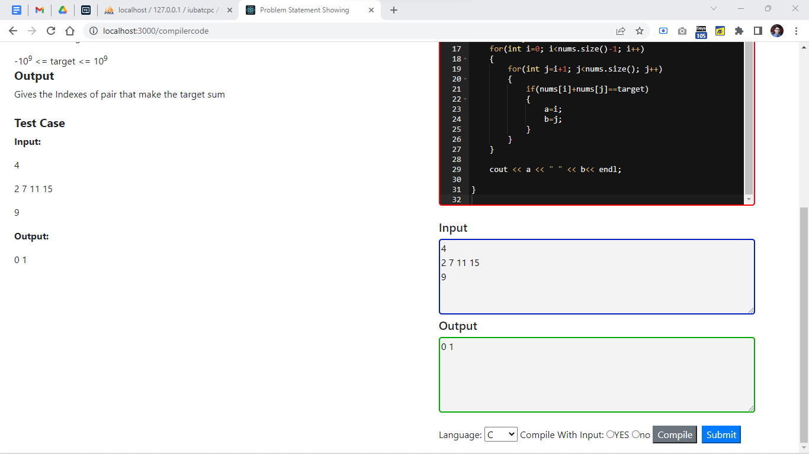

<h3>Submit Code to Online Judge</h3>
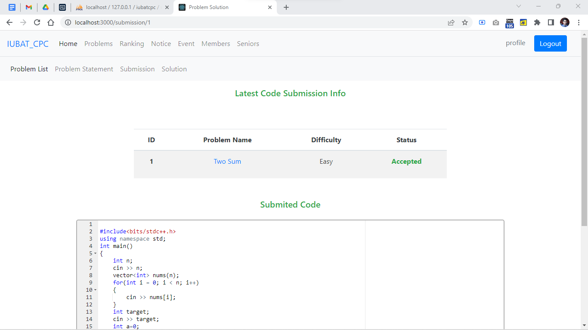

<h3>Problem Seter Solution</h3>
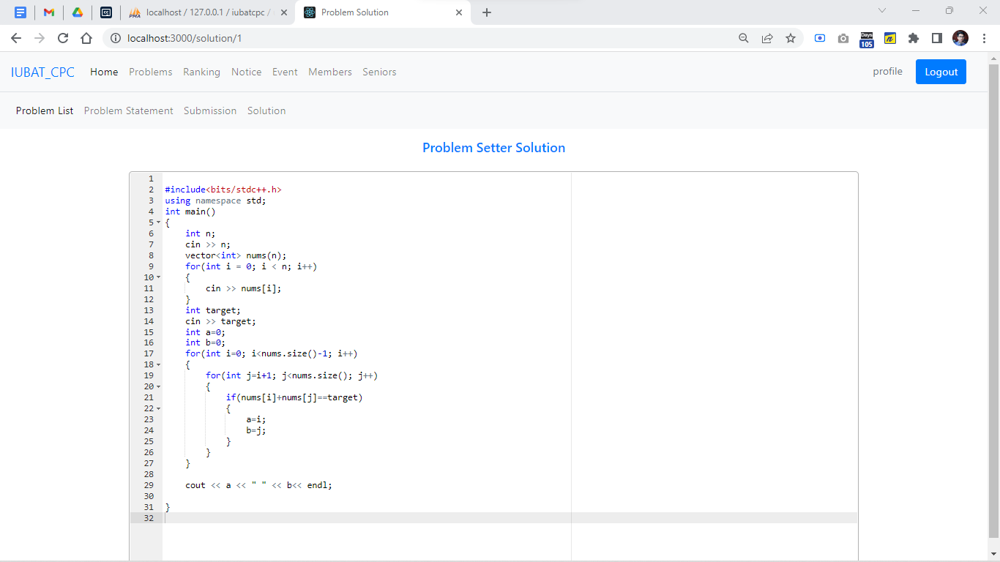

<h3>User Rank Page</h3>
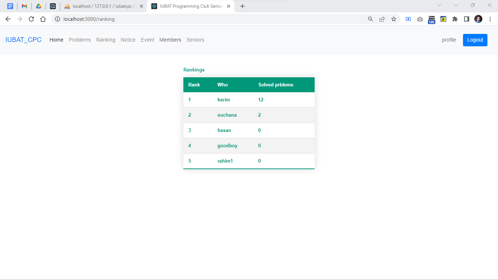

<h3>Notice Panel</h3>
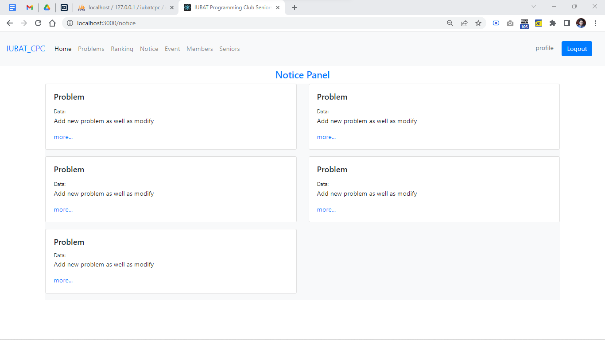

<h3>Senior Member of CPC</h3>
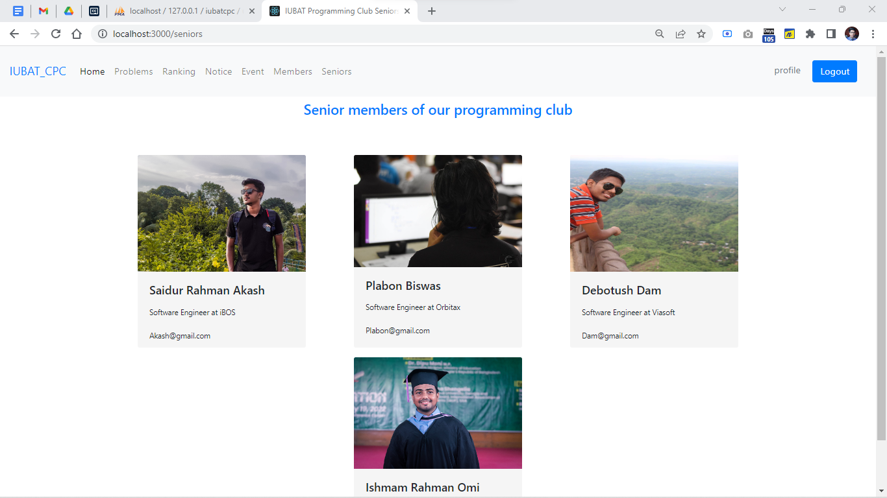

<h3>Admin Panel</h3>
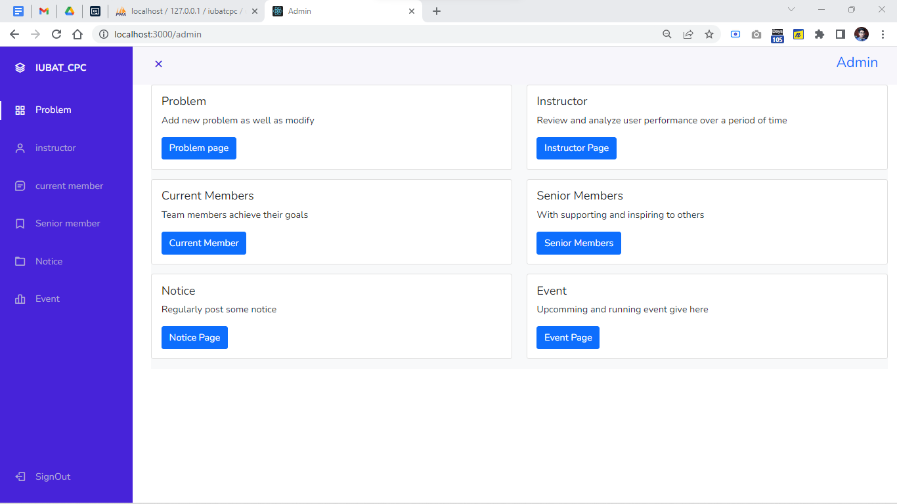

<h3>Problems and CRUD operation</h3>
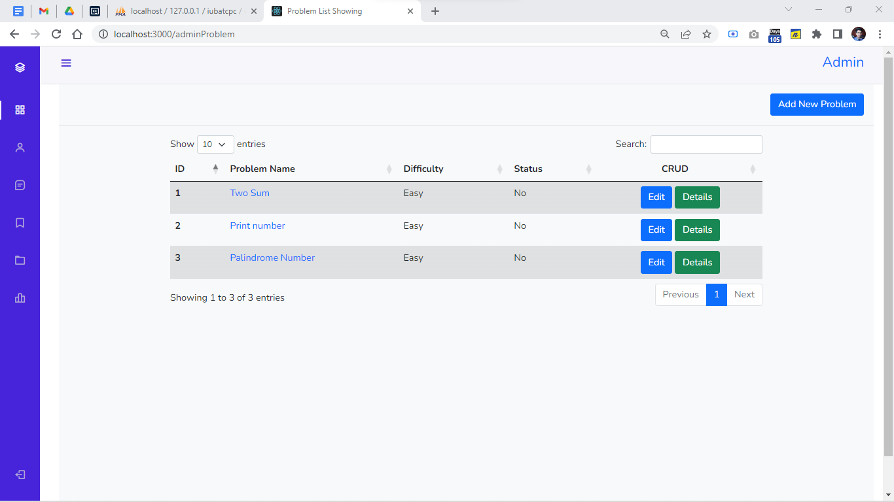

<h3>Add New Problems and Problme setter Solution</h3>
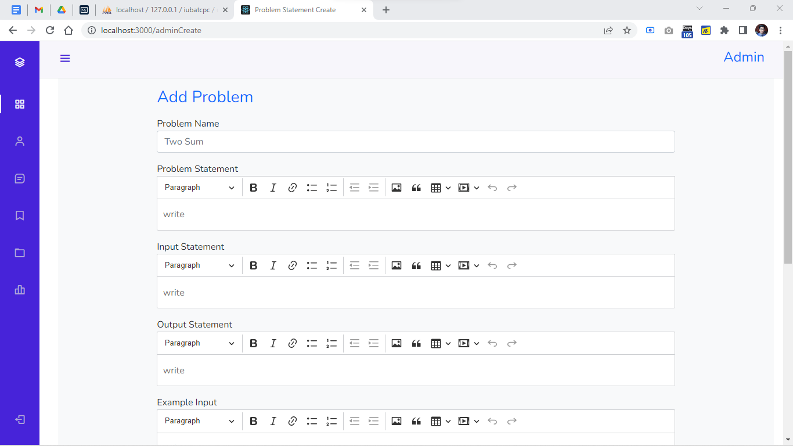

<h3>Instructor see User Performance </h3>
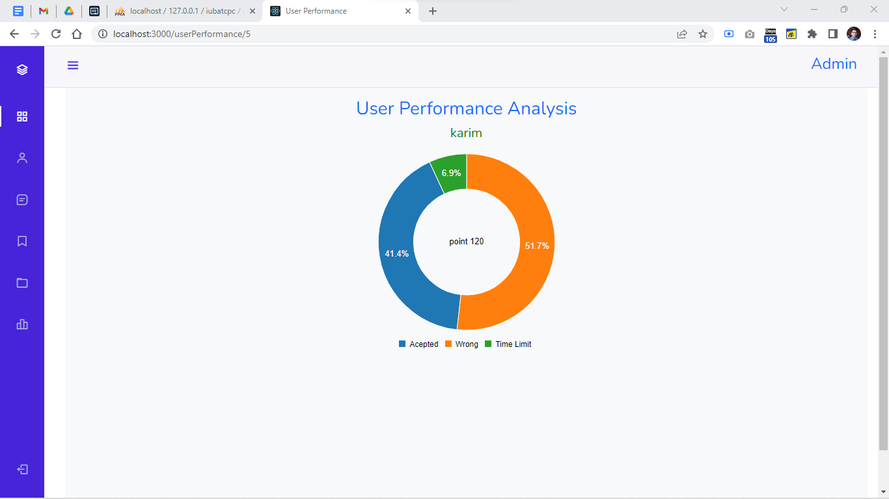

<h3>Snapshort of Database</h3>
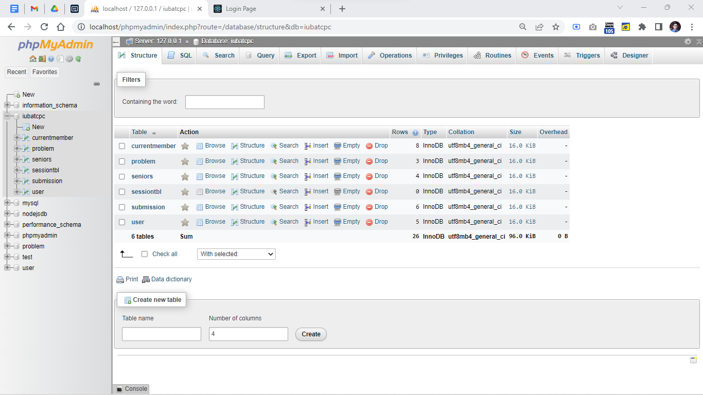

<h2>Thank You for your Time!</h2>
